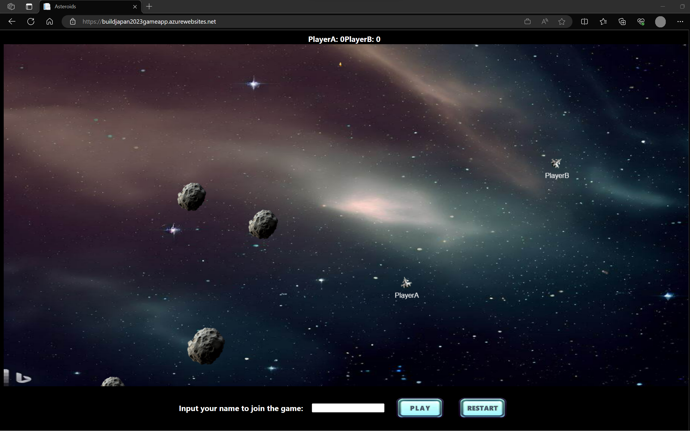
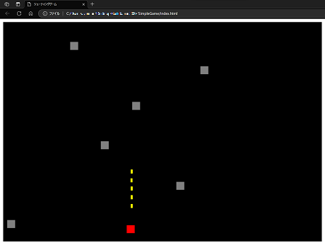

# Build Japan 2023 Game Develop Demo with GitHub Copilot Chat

GitHub Copilot Chat を利用したコーディングデモのサンプルコードです。

**Asteroids Game hosted by Azure App Service**

GitHub Copilit Chat を使いながら Azure App Service (Web App)でホストする Web アプリ (C#, JavaScript) のソースコード例です。 

実際にコードを生成をお試しいただく際は、[こちらの Commit](https://github.com/ayako/BuildJapan2023GameApp/tree/2db79c3a9cbf030fbaf1b217fddfc100ee236012) をお試しください。

**期間限定** [Asteroids Game 公開中](https://buildjapan2023gameapp.azurewebsites.net/)

**Simple HTML and JavaSript Shooting Game**

GitHub Copilot Chat で生成したシューティングゲームのソースコード例です。

index1.html -> index2.html -> index3.html とプロンプト変更(詳細指定)により生成コードが変化します。

## Disclaimer

Source codes in this repository is SAMPLE and REFERENCE ONLY.

このレポジトリのソースコードはサンプルです。
必ずしも正確性および完全性を保証するものではございません。当該情報に基づいて被ったいかなる損害について、一切責任を負うものではございませんのであらかじめご了承ください。